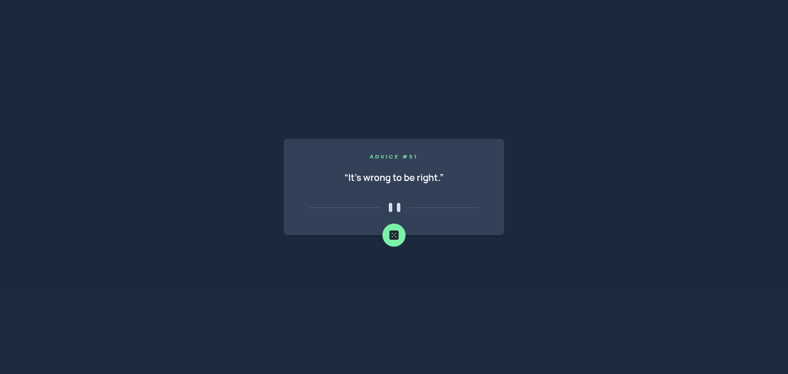

# 🎲 Advice Generator App

A responsive advice generator app built with **React**, **TypeScript**, **Vite**, and **Axios**. Users can fetch randomized pieces of advice at the click of a button powered by the Advice Slip API.

---

## 🖼️ Screenshot

---

## 🔗 Live Demo

👉 **[View the Live Demo Here](https://advice-generator-app-neon-five.vercel.app/)**

---

## 🌟 Features

* **Real-time API Integration:** Fetches random quotes dynamically from the Advice Slip API using **Axios**.
* **Smooth Loading States:** Disables button interactions and displays visual feedback while fetching new advice to prevent spam requests.
* **Responsive Layout:** Pixel-perfect layout tailored for mobile, tablet, and desktop viewports using CSS Grid/Flexbox and media queries.
* **Type-Safe Development:** Fully typed API responses and component props using **TypeScript**.

---

## 🛠️ Built With

* **React** (Vite)
* **TypeScript**
* **Axios** (for HTTP API requests)
* **Tailwind CSS**
* **Google Fonts** (Manrope)
