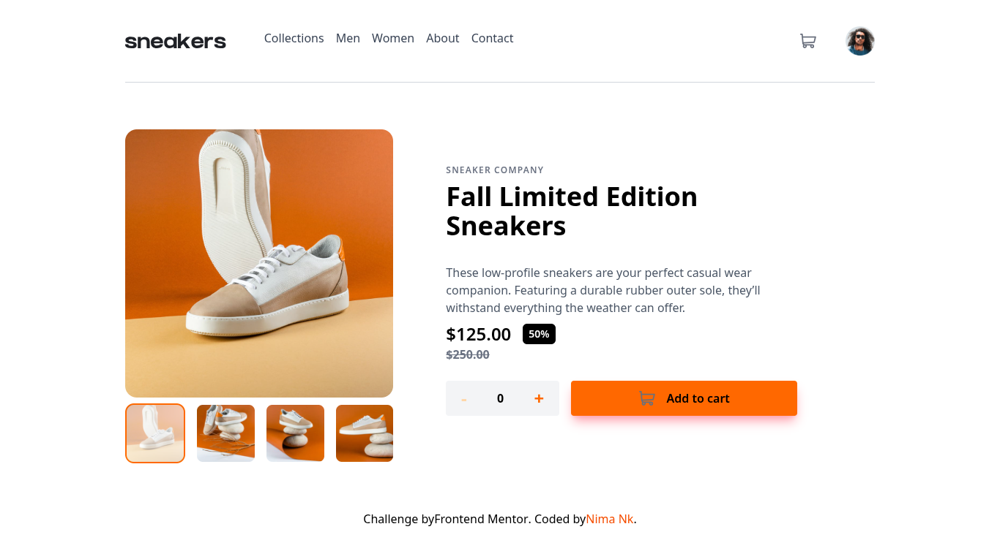

# 🛍️ E-commerce Product Page

A responsive and interactive e-commerce product page built with **React**, **TypeScript**, **Tailwind CSS**, and **Vite**. Features a dynamic image lightbox gallery, cart management system, and custom notifications powered by **SweetAlert**.

---

## 🖼️ Screenshot

---

## 🔗 Live Demo

👉 **[View the Live Demo Here](https://e-commerce-product-page-phi-five.vercel.app/)**

---

## 🌟 Features

- **Interactive Product Gallery:** Main image preview with clickable thumbnails and a full-screen dynamic Lightbox modal on desktop.
- **Cart Management System:** Add items to cart, update quantities, remove items, and view real-time total price calculations.
- **Responsive Navigation:** Mobile menu overlay and custom drawer navigation tailored for small screens.
- **Modern UI & Styling:** Styled cleanly and responsively using **Tailwind CSS**.

---

## 🛠️ Built With

- **React** (Vite)
- **TypeScript**
- **Tailwind CSS**
- **SweetAlert** (for popup alerts & notifications)
