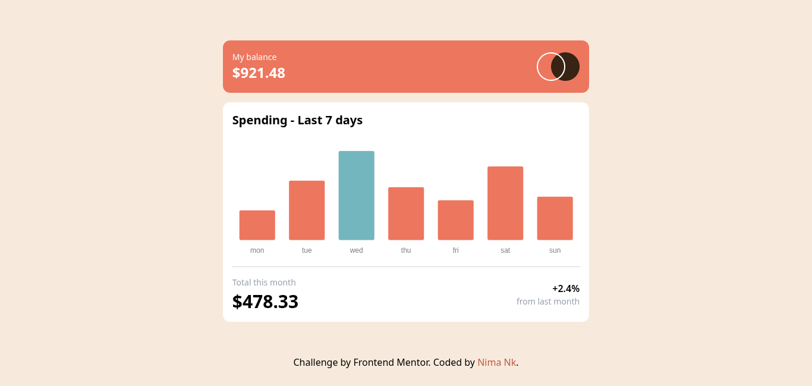

# 📊 Expenses Chart Component

A responsive expenses chart component built with **React**, **TypeScript**, **Tailwind CSS**, and **Chart.js** (`react-chartjs-2`). Users can view their weekly spending data visualized in an interactive bar chart based on a local JSON data source.

---

## 🖼️ Screenshot

---

## 🔗 Live Demo

👉 **[View the Live Demo Here](https://expenses-chart-component-six-omega.vercel.app/)**

---

## 🌟 Features

* **Dynamic Data Rendering:** Reads weekly expense data from a local JSON file and renders it instantly.
* **Interactive Bar Chart:** Built with **Chart.js**, featuring custom tooltips that display exact spending amounts on hover.
* **Auto-Highlight Maximum Spending:** Automatically calculates and highlights the day with the highest expense using a distinct color.
* **Responsive Layout:** Perfectly fits all screen sizes from mobile to desktop using **Tailwind CSS**.
* **Type-Safe Codebase:** Fully typed component props and Chart.js options using **TypeScript**.

---

## 🛠️ Built With

* **React** (Vite)
* **TypeScript**
* **Chart.js** & **react-chartjs-2**
* **Tailwind CSS**
