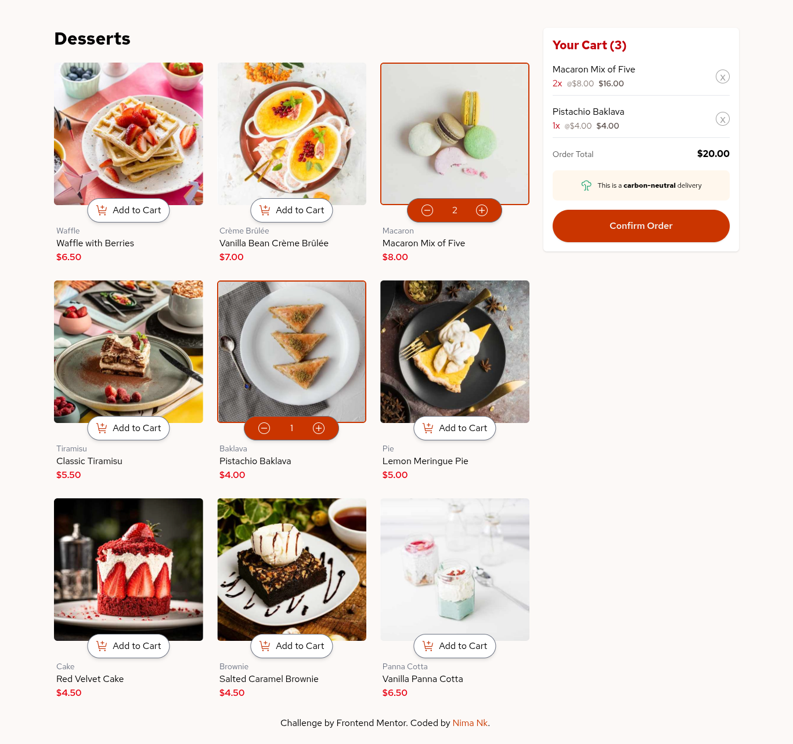

# 🍰 Product List with Cart

A responsive dessert ordering app built with **React**, **TypeScript**, **Context API**, and **Tailwind CSS**. Users can browse products, add items to a shopping cart, adjust quantities, view order totals, and confirm their order with a summary modal.

---

## 🖼️ Screenshot

---

## 🔗 Live Demo

👉 **[View the Live Demo Here](https://product-list-with-cart-gamma-blue.vercel.app/)**

---

## 🌟 Features

* **Global Cart State (React Context):** Centralized cart management powering adding, incrementing, decrementing, and removing items without prop drilling.
* **Dynamic Quantities:** Increase or decrease dessert counts directly from the product card or cart side panel.
* **Cart Summary:** Calculates line-item totals and global order total in real-time.
* **Order Confirmation:** Opens a modal summarizing the order when clicking "Confirm Order" and allows resetting for a new order.
* **Responsive Layout:** Grid view built specifically for mobile, tablet, and desktop viewports.

---

## 🛠️ Built With

* **React** (Vite)
* **Context API**
* **TypeScript**
* **Tailwind CSS**
* **Google Fonts** (Red Hat Text)
